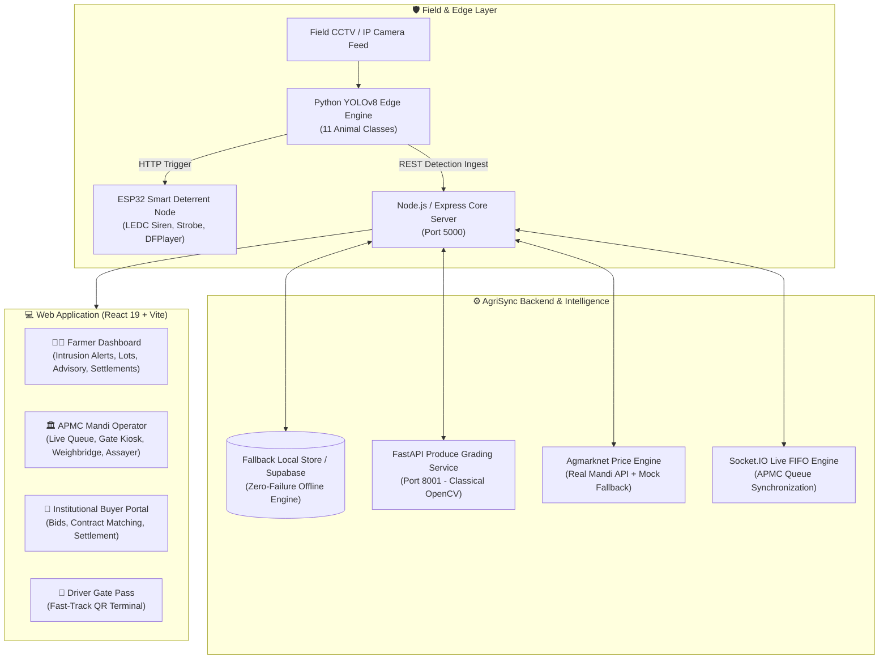

# 🌾 AgriSync — Unified Agricultural Protection & Market Platform

[](https://github.com/kalolaTej/SIH26193)
[](https://github.com/kalolaTej/SIH26193)
[](https://github.com/kalolaTej/SIH26193)
[](https://github.com/kalolaTej/SIH26193)
[](https://github.com/kalolaTej/SIH26193)
[](https://github.com/kalolaTej/SIH26193)
[](https://github.com/kalolaTej/SIH26193)
[](https://github.com/kalolaTej/SIH26193)

> **"Guard the Harvest. Value the Yield. Synchronize the Market."**
> An end-to-end national agricultural intelligence platform unifying **Pre-Harvest Wildlife Intrusion Defense**, **Classical CV Produce Quality Grading**, **APMC Mandi Yard Automation**, and **Dynamic Agmarknet Market Intelligence**.

---

## 📑 Table of Contents

- [Platform Overview](#-platform-overview)
- [System Architecture](#-system-architecture)
- [Core Workflows & Key Modules](#-core-workflows--key-modules)
  - [1. Pre-Harvest Intrusion Defense & IoT Deterrent](#1-pre-harvest-intrusion-defense--iot-deterrent)
  - [2. APMC Mandi Yard Operations](#2-apmc-mandi-yard-operations)
  - [3. Classical CV Produce Grading Microservice](#3-classical-cv-produce-grading-microservice)
  - [4. Market Intelligence & Selling Window Advisory](#4-market-intelligence--selling-window-advisory)
  - [5. Fulfillment, Warehousing & Settlement](#5-fulfillment-warehousing--settlement)
- [Repository Structure](#-repository-structure)
- [Technology Stack](#-technology-stack)
- [Quick Start & Local Setup](#-quick-start--local-setup)
- [Offline / Demo Mode Simulation](#-offline--demo-mode-simulation)
- [API Reference](#-api-reference)
- [Testing & Quality Assurance](#-testing--quality-assurance)
- [License & Acknowledgements](#-license--acknowledgements)

---

## 🌟 Platform Overview

Smallholder farmers in India suffer losses at two critical ends of the agricultural supply chain:
1. **Pre-Harvest Crop Loss**: Up to 35% of standing yield is lost to nocturnal animal intrusions (wild boars, stray cattle, deer, nilgai) without early warning or targeted humane deterrence.
2. **Post-Harvest Value Leakage**: Asymmetrical market pricing, unscientific visual grading at APMC yards, uncoordinated mandi congestion, lack of rural cold storage access, and predatory distress selling.

**AgriSync (SIH26193)** bridges these divides through a single, cohesive platform designed for farmers, APMC mandi operators, assayers, gate security officers, and institutional buyers.

---

## 🏛️ System Architecture



---

## 🎯 Core Workflows & Key Modules

### 1. Pre-Harvest Intrusion Defense & IoT Deterrent
- **Real-Time Edge Detection**: Ultralytics YOLOv8 inference running on RTSP/IP camera streams, targeting 11 distinct wildlife classes (`cow`, `goat`, `pig`, `sheep`, `horse`, `dog`, `cat`, `bear`, `elephant`, `zebra`, `giraffe`).
- **Dynamic Risk Categorization**: Detections classified into `CRITICAL`, `HIGH`, `MEDIUM`, and `LOW` risk tiers with configurable farmer intrusion toggles.
- **Species-Specific Acoustic & Light Deterrent**: ESP32 microcontroller with dual-tone LEDC PWM frequencies (e.g. 12kHz–18kHz sweeps for wild boar, 800Hz/1500Hz for cattle, ultrasonic for canines), high-visibility strobe LEDs, and DFPlayer Mini MP3 predator roar sounds. Full hardware firmware and Wokwi simulation included.
- **Crop Incident Logging & Spatial Analytics**: Farmer-verified crop damage tracking with zone-level and temporal intrusion heatmaps.

### 2. APMC Mandi Yard Operations
- **Live FIFO Queue Console** (`/mandi/queue`): State-managed vehicle progression (`waiting` ➔ `in_progress` ➔ `completed`) with live queue metrics, token generation, and real-time Socket.IO synchronization.
- **ANPR Gate Security Terminal** (`/mandi/gate`): Camera-assisted optical number plate recognition terminal verifying driver QR passes, booking tokens, and driver identification before raising gate barriers.
- **Weighbridge Operator Console** (`/mandi/weighbridge`): Automated gross vehicle weight, tare vehicle weight, and net produce calculations with live weight scale simulation.
- **Digital Quality Assayer** (`/mandi/quality`): Moisture measurement, visual defect percentage calculation, and automated Mandi Lot Grade certification (`Grade A`, `Grade B`, `Grade C`).

### 3. Classical CV Produce Grading Microservice
- **FastAPI Computer Vision Engine** (`grading-service/`): High-throughput produce inspection using classical image processing techniques:
  - **HSV Color Segmentation**: Analyzes surface color uniformity and ripeness indices.
  - **Adaptive Defect Thresholding**: Detects surface blemishes, dark spots, and fungal rot.
  - **Contour Geometry Analysis**: Computes circularity, elongation, and symmetry metrics to determine shape regularity.
- **Transparent Output**: Returns quantifiable numerical scores (surface uniformity %, defect area %, geometric regularity %) without black-box hallucination.

### 4. Market Intelligence & Selling Window Advisory
- **Agmarknet Price Discovery**: Real-time mandi modal price tracking across Indian agricultural commodities with transparent data source tagging (`real` from data.gov.in / `mock` fallback).
- **Rule-Based Selling Window Decision Engine**: Computes price momentum gradients against crop perishable shelf-life decay curves, outputting plain-language advisory: `"Sell Now"` vs. `"Hold N Days"`.
- **Verified Buyer & FPO Matching**: Proximity, volume, and quality-scored matchmaker pairing farmers with bulk institutional purchasers.

### 5. Fulfillment, Warehousing & Settlement
- **Driver Fast-Track Gate Pass** (`/driver/gate-pass`): QR-coded digital gate pass containing commodity batch, net weight, vehicle registration, and destination verification.
- **Cold Storage & Rural Drayage Discovery**: Find accredited warehouse facilities, view temperature zones, and calculate financial holding ROI.
- **Transactions & Sauda Settlement Slips**: Complete accounting workflow tracking APMC trade transactions, payment modes (RTGS/e-Challan), and downloadable formal settlement receipts.

---

## 📂 Repository Structure

```text
SIH26193/
├── index.html                           # AgriSync Master 23-Screen Interactive Layout Launcher
├── README.md                            # Comprehensive Platform Documentation
├── INTEGRATION.md                       # Subsystem Integration & Role-Aware Routing Matrix
├── diagram.json                         # Root Wokwi ESP32 Circuit Specification
├── wokwi.toml                           # Root Wokwi Simulation Configuration
├── platformio.ini                       # PlatformIO Embedded Build Configuration
│
├── ai/                                  # Pre-Harvest AI Vision & Deterrent Controller
│   ├── config.py                        # Stream sources, YOLO thresholds, and camera configs
│   ├── detect.py                        # YOLOv8 live frame inference & event ingestion
│   ├── esp32_controller.py              # HTTP & serial deterrent dispatch to IoT hardware
│   ├── generate_test_video.py           # Automated test video synthesizer for YOLO
│   ├── test_send_detection.py           # Edge ingestion mock script
│   ├── requirements.txt                 # Python dependencies (ultralytics, opencv, requests)
│   └── test_video/cows.mp4              # Sample inference video for offline demo
│
├── esp32/                               # IoT Deterrent Firmware (Production & Simulation)
│   ├── diagram.json                     # Hardware wiring diagram (ESP32, Buzzer, Strobe, UART)
│   ├── wokwi.toml                       # Simulator environment settings
│   ├── sketch.ino                       # Wokwi simulation deterrent sketch
│   └── esp32_deterrent/
│       └── esp32_deterrent.ino          # Production ESP32 firmware with DFPlayer & LEDC PWM
│
├── grading-service/                     # Classical OpenCV Produce Grading Microservice
│   ├── main.py                          # FastAPI service endpoints (POST /grade)
│   ├── grading.py                       # Classical OpenCV image processing pipeline
│   ├── test_grade.py                    # Grading pipeline unit test suite
│   ├── requirements.txt                 # Dependencies (fastapi, uvicorn, opencv-python, numpy)
│   └── README.md                        # Microservice technical documentation
│
├── backend/                             # Core REST API & Socket.IO Real-Time Server
│   ├── server.js                        # Express server bootstrapping & route mounting
│   ├── package.json                     # Node.js backend manifest & scripts
│   ├── schema.sql                       # Complete PostgreSQL / Supabase relational schema
│   ├── controllers/                     # 13 controllers handling all business logic
│   ├── database/
│   │   ├── localStore.js                # Resilient offline/demo fallback storage engine
│   │   └── agrisync_store.json          # Seed state for offline zero-failure demonstration
│   ├── middleware/                      # Auth, RBAC (requireRole), error handling, rate limiting
│   ├── migrations/                      # 6 SQL database migration scripts (001-004)
│   ├── routes/                          # 14 REST route modules
│   ├── services/                        # Agmarknet API, Matching algorithms, Supabase client
│   └── test/
│       └── marketIntelligence.test.js   # 31/31 Automated assertion test suite
│
├── web/                                 # Modern Frontend Web Application
│   ├── index.html                       # HTML5 entrypoint
│   ├── vite.config.js                   # Vite 5 configuration with React plugin
│   ├── tailwind.config.js               # Tailored AgriSync design system & color tokens
│   ├── package.json                     # Frontend dependencies (React 19, Lucide, Tailwind)
│   └── src/
│       ├── App.jsx                      # Role-aware routing & navigation layout shell
│       ├── main.jsx                     # React root bootstrap
│       ├── index.css                    # Design system tokens & utility classes
│       ├── components/                  # Reusable UI cards, charts, modals, deterrent controls
│       ├── context/AuthContext.jsx      # Role-based authentication & session provider
│       └── pages/
│           ├── preharvest/              # Animal Management, Intrusion History, Crop Damage
│           ├── mandi/                   # Live FIFO Queue, Gate Kiosk, Weighbridge, Assayer
│           ├── produce/                 # Produce Batches & Lot Management
│           ├── sell/                    # Selling Advisory & Buyer Matching
│           ├── market/                  # Agmarknet Mandi Prices & APMC Yard Profiles
│           ├── fulfillment/             # Cold Storage, Rural Transport, Settlements
│           ├── driver/                  # Fast-Track QR Driver Gate Pass
│           ├── buyer/                   # Institutional Buyer Bids & Contracts
│           ├── public/                  # Public Portal, Explainer ("How It Works"), e-KYC
│           └── settings/                # Farm Profile & Parameter Settings
│
└── layout/layout/                       # Master 23-Screen Design System & HTML Mockups
```

---

## 🛠️ Technology Stack

| Domain | Technology / Framework | Usage |
|---|---|---|
| **Web Frontend** | React 19, Vite 5, Tailwind CSS | High-performance, responsive operator & farmer dashboards |
| **Icons & Assets** | Lucide React, Google Material Symbols | Consistent agricultural iconography |
| **Backend API** | Node.js (v18+), Express 4 | Modular RESTful API and authentication services |
| **Real-Time Layer** | Socket.IO (v4) | Bidirectional live updates for APMC queue progression |
| **Data & Storage** | Supabase (PostgreSQL) + LocalStore Engine | Dual-mode persistence: cloud Postgres with offline fallback |
| **Edge AI Vision** | Python 3.10+, Ultralytics YOLOv8 | Real-time object detection on RTSP/IP camera streams |
| **Produce CV** | FastAPI, OpenCV (cv2), NumPy | Classical color space analysis, blemish segmentation, geometry |
| **IoT Hardware** | ESP32, C++ / Arduino, Wokwi, PlatformIO | Dual-frequency audio deterrents, strobes, hardware simulation |
| **Market Data** | Agmarknet (data.gov.in) REST API | Indian agricultural commodity price feed with mock fallback |

---

## 🚀 Quick Start & Local Setup

### Prerequisites
- **Node.js** v18.0.0 or higher
- **Python** 3.10 or higher
- **npm** v9 or higher

---

### Step 1: Clone the Repository
```bash
git clone https://github.com/kalolaTej/SIH26193.git
cd SIH26193
```

---

### Step 2: Start the Backend Server
```bash
cd backend
npm install
cp .env.example .env     # Pre-configured with local fallback defaults
npm run dev              # Or 'npm start'
```
*Backend runs on `http://localhost:5000` (Health check: `http://localhost:5000/api/health`)*

---

### Step 3: Start the Web Dashboard
```bash
cd ../web
npm install
cp .env.example .env     # Points VITE_API_URL to http://localhost:5000
npm run dev
```
*Frontend runs on `http://localhost:5173`*

---

### Step 4: Start the Classical CV Produce Grading Microservice (Optional)
```bash
cd ../grading-service
python -m venv venv

# Windows:
.\venv\Scripts\activate
# Linux/macOS:
source venv/bin/activate

pip install -r requirements.txt
uvicorn main:app --host 0.0.0.0 --port 8001 --reload
```
*Grading microservice runs on `http://127.0.0.1:8001` (Interactive Swagger Docs: `http://127.0.0.1:8001/docs`)*

---

### Step 5: Launch the Edge AI Detection Engine (Optional)
```bash
cd ../ai
pip install -r requirements.txt
python detect.py
```

---

## ⚡ Offline / Demo Mode Simulation

AgriSync incorporates an automated **LocalStore Fallback Engine** (`backend/database/localStore.js` and `backend/database/agrisync_store.json`).

- **Zero-Failure Evaluation**: If Supabase credentials or internet access are unavailable during hackathon evaluation, the backend automatically falls back to the local database file.
- **Full Operational State**: Pre-seeded with realistic produce lots, farmer profiles, camera feeds, APMC mandi queue entries, storage facilities, and trade transactions.
- **Hardware Simulation**: The ESP32 deterrent features complete serial command echoing (`DETER:pig`, `STOP`, `STATUS`) enabling full demonstration inside the browser via the Wokwi web simulator or serial monitor.

---

## 📡 API Reference

### Pre-Harvest & Animal Intrusion
| Method | Endpoint | Description |
|---|---|---|
| `GET` | `/api/cameras` | List perimeter camera nodes, status & battery levels |
| `POST` | `/api/cameras` | Register a new camera node |
| `GET` | `/api/detections` | Retrieve detection event feed (labeled `real` or `simulated`) |
| `POST` | `/api/detections` | Ingest edge YOLO detection event |
| `POST` | `/api/esp32/trigger` | Dispatch hardware deterrent trigger to ESP32 node |
| `POST` | `/api/esp32/stop` | Silence all active sirens and strobes |
| `GET` | `/api/incidents` | List crop damage incidents |
| `POST` | `/api/incidents` | Log farmer crop-loss incident |
| `GET` | `/api/incidents/analytics` | Fetch intrusion heatmaps by zone & period |

### APMC Mandi Operations & Quality Assaying
| Method | Endpoint | Description |
|---|---|---|
| `GET` | `/api/procurement/queue/:centre_id` | Live FIFO procurement queue list |
| `PATCH` | `/api/procurement/bookings/:id/advance` | Advance vehicle state (`waiting` ➔ `in_progress` ➔ `completed`) |
| `POST` | `/api/procurement/book-slot` | Reserve mandi yard arrival time-slot |
| `POST` | `/grade` *(FastAPI Port 8001)* | Classical OpenCV produce quality grading |

### Market Intelligence, Advisory & Logistics
| Method | Endpoint | Description |
|---|---|---|
| `GET` | `/api/prices` | Agmarknet commodity prices (with transparent `real`/`mock` tag) |
| `GET` | `/api/prices/trend` | Historical price trends across APMC mandis |
| `GET` | `/api/lots/:id/sale-window` | Rule-based "Sell Now" / "Hold" advisory |
| `POST` | `/api/sale-window/simulate` | Multi-day revenue vs. spoilage economic simulation |
| `GET` | `/api/lots/:id/matches` | Ranked buyer & FPO purchase matches |
| `GET` | `/api/lots/:id/logistics-suggestion` | Cold storage facility recommendation & ROI |
| `GET` | `/api/transactions` | List trade transactions and settlement records |
| `GET` | `/api/transactions/:id` | Fetch specific Sauda trade settlement detail |

---

## 🧪 Testing & Quality Assurance

AgriSync includes an automated end-to-end integration test suite verifying market pricing, fallback logic, selling advisory models, buyer matchmaking, and logistics engines.

To execute the test suite:
```bash
cd backend
node test/marketIntelligence.test.js
```

### Verified Test Assertions (31/31 Passing):
```text
✅ PASS: GET /api/prices returns 200
✅ PASS: GET /api/prices returns non-empty array
✅ PASS: Price record has crop_type, modal_price, and source
✅ PASS: Price record source is strictly "real" or "mock"
✅ PASS: GET /api/prices with missing crop returns 200
✅ PASS: Fallback returns mock records for missing crop
✅ PASS: Missing crop fallback is clearly labeled source: "mock"
✅ PASS: GET /api/prices/trend returns 200
✅ PASS: Price trend returns array of time-series records
✅ PASS: Trend record matches schema: price_date, modal_price, source
✅ PASS: GET /api/lots/:id/sale-window returns 200
✅ PASS: Sale window returns correct lot_id
✅ PASS: Sale window recommendation is "sell_now" or "hold"
✅ PASS: Sale window provides plain-language rationale
✅ PASS: POST /api/buyer-profile returns 201 Created
✅ PASS: Created buyer profile contains id and crop_type
✅ PASS: GET /api/lots/:id/matches returns 200
✅ PASS: Lot matches returns an array
✅ PASS: Lot match contains buyer_id and numeric match_score
✅ PASS: Lot match status is valid
✅ PASS: GET /api/buyers/:id/matches returns 200
✅ PASS: Buyer matches returns an array
✅ PASS: Buyer match has lot_id and match_score
✅ PASS: PATCH /api/matches/:id returns 200
✅ PASS: Match status updated to "interested"
✅ PASS: GET /api/lots/:id/logistics-suggestion returns 200
✅ PASS: Logistics returns recommended facility
✅ PASS: Logistics returns alternatives array
✅ PASS: Recommended facility includes plain reason
✅ PASS: GET /api/logistics/facilities returns 200
✅ PASS: Logistics facilities list returns seeded facilities

--- Test Results: 31 Passed, 0 Failed ---
```

---

## 👥 The AgriSync Team

Developed with pride for **Smart India Hackathon (SIH 2026)**.

| Contributor | Focus Area |
|---|---|
| **Aayush Barasara** | Pre-Harvest Edge AI, YOLOv8 Vision Pipeline & ESP32 Deterrent Hardware |
| **Tej Kalola** | Market Intelligence, Agmarknet API Integration, Selling Advisory & Logistics |
| **Krushn Kachhadiya** | Post-Harvest Core, OpenCV Grading Microservice & Queue Synchronization |
| **Vashishth Baraiya** | Full-Stack Integration, Role-Aware Routing, Navigation & UI System |

---

## 📄 License

This project is licensed under the **MIT License** — see the [LICENSE](LICENSE) file for details.
